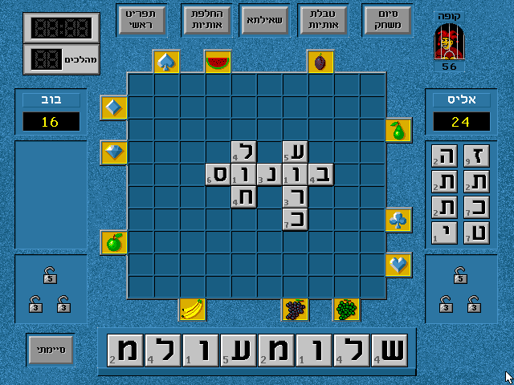
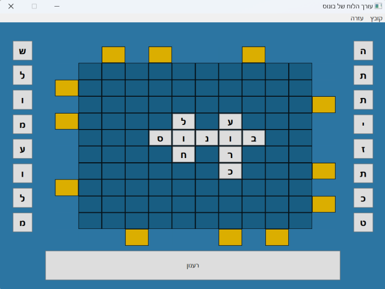
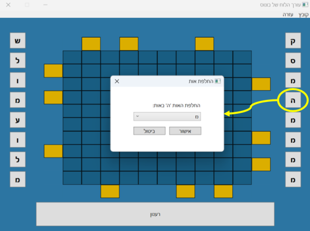
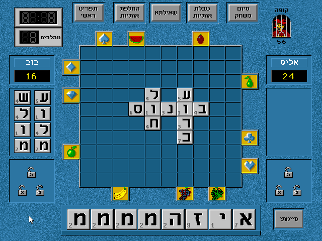
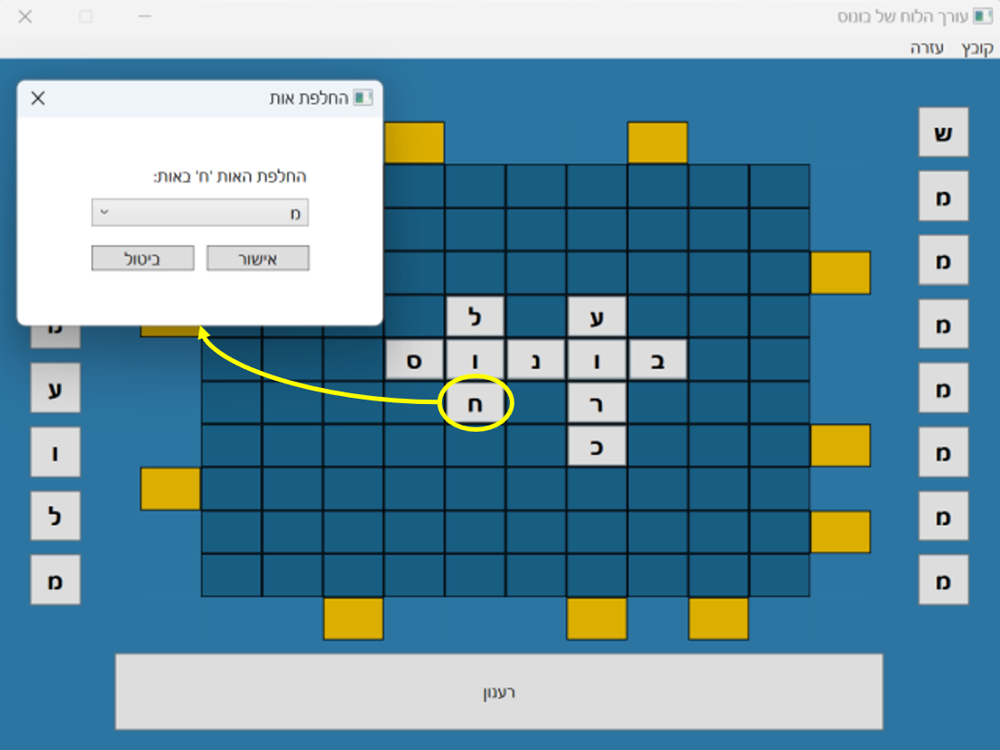
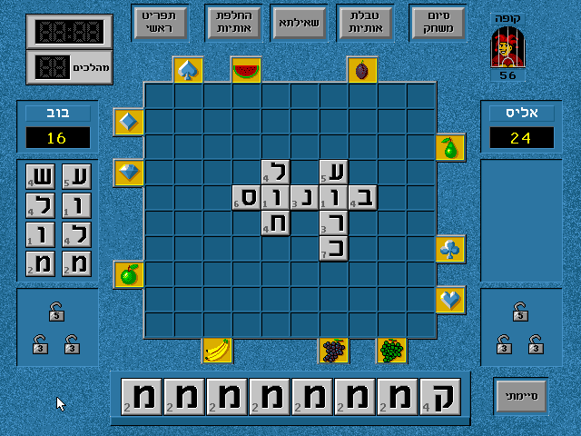

# Bonus Board State Editor

[Bonus](https://he.wikipedia.org/wiki/%D7%91%D7%95%D7%A0%D7%95%D7%A1_(%D7%9E%D7%A9%D7%97%D7%A7_%D7%9E%D7%97%D7%A9%D7%91)) is a Hebrew Scrabble game released for DOS in 1993. It was very popular at the time, and even today many would agree that it hasn't lost its magic.

The game is designed for two players, where each player can be either human or controlled by the computer. Beating the computer was HARD, and players searched for ways to cheat:

 * Limiting the time that the computer had to find a word to place on the board by interrupting it immediately. This caused the computer to find low-quality words, and sometimes even to fail finding a word altogether.
 * Placing illegal words and using the "appeal" feature to approve them

This project offers a third option to cheat: The ability to edit the board state by changing the players' letters or the board tiles.

## Usage

Follow these steps to use the board state editor:

 1. Purchase a copy of Bonus
 2. Run Bonus using [DOSBox](https://www.dosbox.com/) - a popular DOS emulator
    * Be sure to have only one copy of DOSBox running on your system or the board state editor will fail to locate the game
 3. Start a new game of Bonus
 4. Launch the board state editor
 5. Use the board state editor to modify the different letters/tiles
    * Note: In order to see the result in the game itself, you must force the game to redraw the tiles (see examples below)

## Examples

### Basic User Interface

Board State Editor:  

Game:  

### Changing Player Letters

### Changing Board Tiles

## Troubleshooting

### 1. The board state editor displays and error message upon execution

Make sure that:

 * You only have one instance of DOSBox running on your system
 * You've launched Bonus in DOSBox and started a new game (i.e. you see the board)
 * You're running on Windows
 * Advanced: You did not change the default memory size for DOSBox (i.e. `memsize=16` in `dosbox.conf`)

## Technical Details

The board state editor uses the Win32 API to read and write the game's memory by:

 * Opening a handle to the `DOSBox` process
 * Locating the `GameMemoryStart` offset within DOSBox's internal memory
 * Using `ReadProcessMemory` and `WriteProcessMemory` to read and modify the game state

## License 

Released under MIT License.